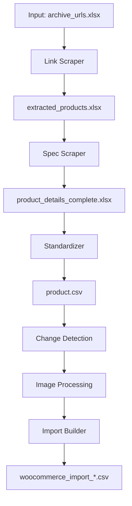

# PROJECT_KNOWLEDGE.md

## 1. Project Overview

### Problem Solved
This project automates the extraction, processing, and import of product data from e-commerce websites into WooCommerce. It handles:
- Web scraping of product links and specifications.
- Image downloading, processing, and renaming.
- Data standardization and transformation into WooCommerce-compatible CSV files.
- Incremental updates to minimize reprocessing of unchanged products.

### Main Purpose
To migrate and synchronize product catalogs from external websites into WooCommerce with minimal manual intervention, supporting both full and incremental updates.

### Target Users
- E-commerce managers.
- Data migration specialists.
- Developers maintaining WooCommerce stores.

### High-Level Workflow

---

## 2. Architecture Overview

### System Architecture
The project is modular, with each stage producing file-based outputs consumed by the next stage:

1. **product_extraction**: Scrapes product links and specifications.
2. **data/reference**: Stores intermediate and final data files.
3. **image_processing**: Downloads and processes product images.
4. **import_builder**: Generates WooCommerce-compatible CSV files.

### Data Flow
- **Input**: `archive_urls.xlsx` (list of URLs to scrape).
- **Intermediate**: `extracted_products.xlsx`, `product_details_complete.xlsx`.
- **Outputs**: `product.csv`, `woocommerce_import_*.csv`.

### External Integrations
- **WooCommerce**: CSV import.
- **Gemini AI**: Used for translating product names and colors (fallback to manual mapping).
- **Selenium**: Web scraping.

---

## 3. Directory Structure

| Directory | Purpose | Key Files |
|-----------|---------|-----------|
| `product_extraction/` | Core scraping and processing logic | `main.py`, `web_panel_interactive.py`, `scrapers/`, `standardizer.py` |
| `import_builder/` | WooCommerce CSV generation | `runner.py`, `woocommerce_generator_v12.py`, `config_v9.py` |
| `image_processing/` | Image download and processing | `Image_Downloader.py`, `unified_image_processor.py` |
| `data/reference/` | Reference data and mappings | `color_mapping.xlsx`, `product_names.xlsx` |
| `runtime/` | State and logs | `state/`, `logs/` |
| `tests/` | Unit tests | `test_*.py` |
| `docs/` | Documentation | `ARCHITECTURE.md`, `DATA_FLOW.md` |

---

## 4. Entry Points

### Main Executable Files
- **`product_extraction/main.py`**: CLI entry point for the pipeline.
  - Commands: `scrape-links`, `scrape-specs`, `standardize`, `import-build`, `track`, `dashboard`, `full`, `auto`, `test`.
  - Example: `python main.py auto --mode incremental`.

- **`product_extraction/web_panel_interactive.py`**: Interactive web panel (Flask).
  - Access: `http://localhost:5000`.

- **`import_builder/runner.py`**: Automated WooCommerce CSV generation.
  - Called by `main.py` during pipeline execution.

### Startup Scripts
- **`run_pipeline.ps1`** / **`run_pipeline.bat`**: Windows scripts to start the pipeline.

### Scheduled Jobs
- None (manual or event-triggered execution).

---

## 5. Core Modules

### Product Extraction (`product_extraction/`)
- **Purpose**: Scrapes product links and specifications from target websites.
- **Inputs**: `archive_urls.xlsx`.
- **Outputs**: `extracted_products.xlsx`, `product_details_complete.xlsx`.
- **Key Functions**:
  - `run_link_scraper()`: Extracts product links.
  - `run_spec_scraper()`: Extracts product specifications.
  - `run_standardizer()`: Standardizes data into `product.csv`.

### Import Builder (`import_builder/`)
- **Purpose**: Generates WooCommerce-compatible CSV files.
- **Inputs**: `product.csv`, processed images.
- **Outputs**: `woocommerce_import_*.csv`.
- **Key Functions**:
  - `process_products_v12()`: Transforms data into WooCommerce format.
  - `runner.py`: Automates CSV generation.

### Image Processing (`image_processing/`)
- **Purpose**: Downloads and processes product images.
- **Inputs**: `extracted_products.xlsx`.
- **Outputs**: Processed images in `data/outputs/processed_images/`.
- **Key Functions**:
  - `Image_Downloader.py`: Downloads images using Selenium.
  - `unified_image_processor.py`: Compresses and renames images.

### Change Detection (`trackers/compare_scans.py`)
- **Purpose**: Identifies new, changed, or removed products for incremental updates.
- **Inputs**: `product.csv`, previous WooCommerce catalog.
- **Outputs**: Manifests for new/updated products (`new_products_list.csv`, `updated_products_list.csv`).

---

## 6. Data Flow Analysis

### Lifecycle of Data
1. **Input**: `archive_urls.xlsx` (list of URLs to scrape).
2. **Link Scraper**: Produces `extracted_products.xlsx` (product links).
3. **Spec Scraper**: Produces `product_details_complete.xlsx` (product specifications).
4. **Standardizer**: Produces `product.csv` (standardized data).
5. **Change Detection**: Compares against previous catalog to identify changes.
6. **Image Processing**: Downloads and processes images for new/changed products.
7. **Import Builder**: Generates `woocommerce_import_*.csv` (WooCommerce-compatible).

### Transformations
- **Standardization**: Product names, colors, and attributes are standardized using mapping files or Gemini AI.
- **Image Processing**: Images are renamed to match WooCommerce SKUs and compressed.

---

## 7. Configuration System

### Environment Variables
| Variable | Purpose | Default |
|----------|---------|---------|
| `AUTO_MODE` | Enables automatic pipeline execution | `0` |
| `AUTO_RESUME` | Resumes pipeline from checkpoint | `0` |
| `IMPORT_EXPECTED_SKUS` | SKUs to process in incremental mode | `None` |
| `NEW_MANIFEST` | Path to new products manifest | `None` |
| `UPDATED_MANIFEST` | Path to updated products manifest | `None` |

### Configuration Files
- **`import_builder/config_v9.py`**: Paths, URLs, and settings for WooCommerce CSV generation.
- **`data/reference/color_mapping.xlsx`**: Maps Persian color names to English.
- **`data/reference/product_names.xlsx`**: Maps Persian product names to English.

---

## 8. Database and Storage

### File-Based Storage
- **Intermediate Files**: Stored in `data/reference/` and `runtime/state/`.
- **Outputs**: Stored in `data/outputs/` and `runtime/reports/`.
- **Images**: Downloaded to `data/outputs/downloaded_images/`, processed in `data/outputs/processed_images/`.

### State Management
- **`pipeline_state.json`**: Tracks pipeline execution state (e.g., `running`, `complete`).
- **Checkpoints**: Individual scrapers save progress to resume interrupted runs.

---

## 9. External Services

### APIs and SDKs
- **Gemini AI**: Used for translating product names and colors.
- **Selenium**: Web scraping.

### Authentication
- None (Selenium uses headless browsers; Gemini AI requires an API key).

---

## 10. Execution Workflows

### Normal Execution
1. **Link Scraper**: Extracts product links from `archive_urls.xlsx`.
2. **Spec Scraper**: Extracts specifications from product links.
3. **Standardizer**: Standardizes data into `product.csv`.
4. **Change Detection**: Identifies new/changed products.
5. **Image Processing**: Downloads and processes images for new/changed products.
6. **Import Builder**: Generates WooCommerce CSV files.

### Resume Execution
- The pipeline resumes from the last completed step using `pipeline_state.json`.

### Error Handling
- **Validation**: Each stage validates its inputs and outputs (e.g., freshness, non-empty files).
- **Retries**: Subprocesses (e.g., image processing) are retried on failure.
- **Logging**: Errors are logged to `runtime/logs/error.log`.

### Recovery Mechanisms
- **Checkpoints**: Individual scrapers save progress to resume interrupted runs.
- **State Tracking**: `pipeline_state.json` ensures stages are not skipped or repeated.

---

## 11. State Management

### Progress Tracking
- **`pipeline_state.json`**: Tracks the status of each pipeline stage (`running`, `done`, `failed`).
- **Checkpoints**: Individual scrapers save progress (e.g., `link_scraper_progress.json`).

### Resume Behavior
- The pipeline resumes from the last completed step using `pipeline_state.json`.

---

## 12. Input and Output Inventory

### Input Files
| File | Purpose | Location |
|------|---------|----------|
| `archive_urls.xlsx` | List of URLs to scrape | `baseline/sample_input/` |
| `color_mapping.xlsx` | Color name mappings | `data/reference/` |
| `product_names.xlsx` | Product name mappings | `data/reference/` |

### Generated Files
| File | Purpose | Location |
|----------------------|---------|----------|
| `extracted_products.xlsx` | Product links | `data/reference/` |
| `product_details_complete.xlsx` | Product specifications | `data/reference/` |
| `product.csv` | Standardized product data | `data/outputs/` |
| `woocommerce_import_*.csv` | WooCommerce-compatible CSV | `data/outputs/` |

### Temporary Files
| File | Purpose | Location |
|------|---------|----------|
| `pipeline_state.json` | Pipeline state | `runtime/state/` |
| `link_scraper_progress.json` | Link scraper progress | `runtime/state/` |

---

## 13. Important Business Rules

### Validation Rules
- **Freshness**: Outputs must be written by the current run (not stale).
- **Non-Empty**: Outputs must contain at least one row of data.
- **Coverage**: Image processing must cover all expected SKUs.

### Processing Rules
- **Incremental Mode**: Only processes new or changed products.
- **Full Mode**: Processes all products from scratch.
- **Image Naming**: Images are renamed to match WooCommerce SKUs (e.g., `9266a_black.webp`).

---

## 14. Testing

### Existing Tests
- **Unit Tests**: Located in `tests/`.
  - Example: `test_step_pricing.py`, `test_price_utils.py`.

### Test Execution
- **CLI**: `python main.py test`.
- **Direct**: `pytest tests/`.

### Missing Tests
- Integration tests for the full pipeline.
- Tests for incremental mode and change detection.

---

## 15. Known Issues and Technical Debt

### Resolved Issues (Fixed 2026-07-23)
- **Image Processor Category Mismatch**: Previously scanned all dated subfolders in `downloaded_images/` combining 244 categories from 3 sessions instead of just the latest session's 33 categories. **Fixed** in `image_processing/unified_image_processor.py` to use only the latest dated subfolder.
- **Duplicate Variation Images**: Unmatched color variations fell back to `main_image`, causing all variations to share the same image. **Fixed** in `import_builder/woocommerce_generator_v12.py` to use general images (01, 02, 03...) as fallback before `main_image`.
- **Incomplete Color Similarity Mapping**: Missing color equivalences (white~silver/light-gray, cream~light-gray, honey~tan/beige) caused false fallbacks. **Fixed** in `import_builder/color_similarity.py` with bidirectional mappings.
- **Encoding Errors on Windows**: Emoji/unicode characters caused `UnicodeEncodeError` on CP1252 consoles. **Fixed** by replacing all emojis with ASCII-safe alternatives in `woocommerce_generator_v12.py`, `image_naming_v11_fixed.py`, `color_similarity.py`, `color_manager.py`, `product_name_manager.py`.
- **Missing Dimension Translation**: The `attribute_name:dimention` column showed English "dimention" instead of Persian "ابعاد". **Fixed** by adding `ATTRIBUTE_NAMES['dimention'] = 'ابعاد'` in `woocommerce_generator_v12.py`.

### Weaknesses
- **Selenium Dependency**: Web scraping is brittle and may break due to website changes.
- **Gemini AI Fallback**: Unresolved colors/names require manual mapping.

### Risks
- **Stale Data**: Pipeline may consume stale outputs if validation fails.
- **Timeouts**: Long-running subprocesses may time out.

### Code Smells
- **Hardcoded Paths**: Some paths are hardcoded in scripts.
- **Duplicate Logic**: Similar validation logic across stages.

### Architectural Concerns
- **File-Based Integration**: Stages communicate via files, which can lead to race conditions or stale data.
- **Lack of Database**: No centralized database for product data.

---

## 16. Improvement Recommendations

### Critical
- **Database Integration**: Replace file-based storage with a database (e.g., SQLite, PostgreSQL).
- **Error Recovery**: Improve resilience to Selenium failures (e.g., retries, fallbacks).

### High
- **Modularization**: Further modularize shared utilities (e.g., logging, file operations).
- **Testing**: Add integration tests for the full pipeline.

### Medium
- **Configuration**: Centralize configuration in a single file (e.g., `config.yaml`).
- **Documentation**: Expand documentation for business rules and edge cases.

### Low
- **UI Improvements**: Enhance the web panel for better usability.
- **Performance**: Optimize image processing for faster execution.

---

## 17. AI Handover Section

### What the Project Does
Automates the extraction, processing, and import of product data from e-commerce websites into WooCommerce, supporting both full and incremental updates.

### Current Architecture
Modular pipeline with file-based integration between stages:
1. **Product Extraction**: Scrapes product links and specifications.
2. **Image Processing**: Downloads and processes images.
3. **Import Builder**: Generates WooCommerce-compatible CSV files.

### Important Files
- **`product_extraction/main.py`**: CLI entry point.
- **`import_builder/runner.py`**: WooCommerce CSV generation.
- **`trackers/compare_scans.py`**: Change detection for incremental updates.

### Important Workflows
- **Full Pipeline**: `python main.py auto --mode full`.
- **Incremental Pipeline**: `python main.py auto --mode incremental`.
- **Web Panel**: `python web_panel_interactive.py`.

### Known Limitations
- **Selenium Dependency**: Web scraping is brittle.
- **File-Based Integration**: Prone to race conditions and stale data.
- **Gemini AI Fallback**: Unresolved colors/names require manual mapping.

### How to Understand the Project
1. Start with `README.md` and `docs/ARCHITECTURE.md`.
2. Review `product_extraction/main.py` for pipeline logic.
3. Examine `import_builder/runner.py` for WooCommerce CSV generation.
4. Check `trackers/compare_scans.py` for change detection logic.